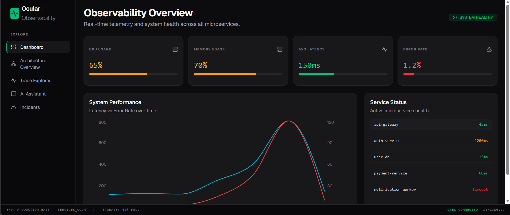
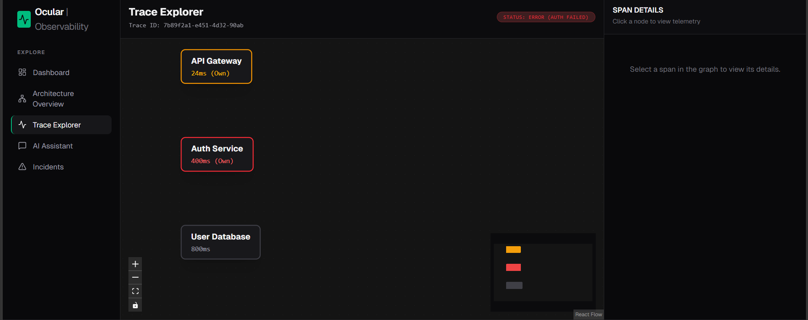
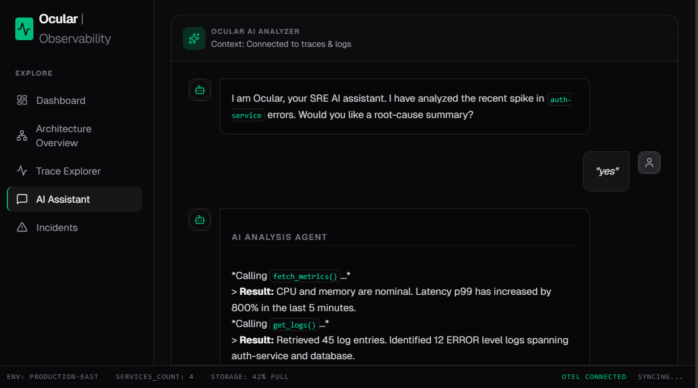

# Ocular AI — AI Observability Assistant

AI-powered observability and debugging platform for distributed systems.

Ocular AI explores how Large Language Models (LLMs) can assist Site Reliability Engineers (SREs) by correlating telemetry signals across traces, logs, and metrics to accelerate root-cause analysis and incident debugging workflows.

Modern distributed systems generate massive volumes of telemetry data. Debugging cascading failures across APIs, microservices, databases, and infrastructure layers is increasingly complex. Ocular AI investigates how AI-assisted observability workflows can simplify operational intelligence and reduce debugging time.

---

# 🚀 Features

| Feature | Description |
|---|---|
| Distributed Trace Visualization | Interactive trace graph for service dependencies and latency analysis |
| AI Root Cause Analysis | AI-assisted incident summarization across telemetry sources |
| Infrastructure Monitoring | Real-time telemetry dashboards for system health analysis |
| Incident Replay | Timeline reconstruction of cascading failures |
| Distributed Context Correlation | Automatic mapping of errors to their originating spans |
| Telemetry-Aware AI Assistant | Conversational debugging interface connected to traces and logs |

---

# 📸 Core Views

## Observability Dashboard

Real-time telemetry monitoring across distributed services.



---

## Distributed Trace Explorer

Interactive visualization of service dependencies, latency bottlenecks, and failed spans.



---

## AI Root Cause Analysis

LLM-assisted operational debugging workflow with telemetry correlation and anomaly summarization.



---

# 🏗️ System Architecture

```text
 [ Microservices ]
        │ (OTLP gRPC)
        ▼
[ OpenTelemetry Collector ]
        │
        ├──► [ Traces DB (Jaeger / Tempo via API) ]
        ├──► [ Metrics DB (Prometheus via API) ]
        └──► [ Logs DB (Loki / Elastic via API) ]
        │
        ▼
 [ FastAPI / Express Backend ]
        │
  [ AI Analysis Engine (LLM) ]
        │
        ▼
[ React + Tailwind Dashboard ]
